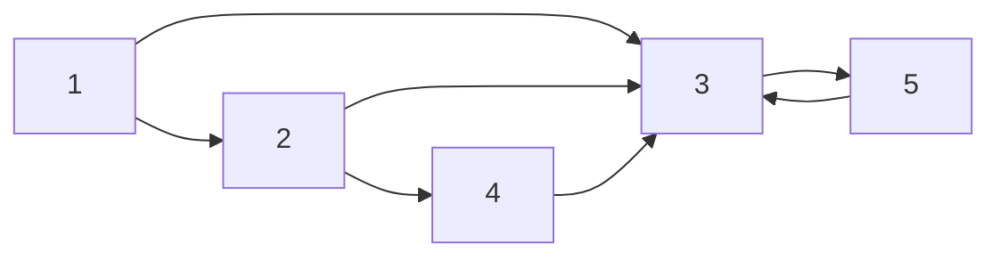
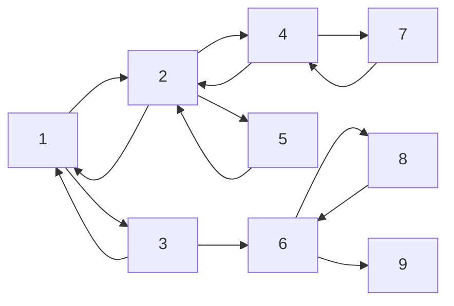

# 描述

现有**有向图**，共n个节点，m条边。起点为1，终点为n。请给出一条**最短**的路径，按照**指定顺序**经过指定点**（不一定连续）**。

# 输入格式

第一行有两个正整数n、m。

接下来的m行，每行两个整数x、y、z，分别表示这条边的起点、终点。

第(m+1)行有一个整数k，表示需经过点的数量。

第(m+2)行有k个整数，表示需经过的点的编号及顺序。

# 输出格式

路径上的点的序号，如无法实现，则输出-1

# 样例1

## 样例输入

5 8

1 2

1 3

2 3

2 4

4 3

3 1

3 5

5 3

6

4 1 5 2 5 3

##  样例输出

1 2 4 3 1 3 5 3 1 2 3 5 3 5

## 样例图示

# 样例2

## 样例输入

9 14

1 2

1 3

2 5

2 4

2 1

3 1

3 6

5 2

4 2

4 7

6 8

6 9

7 4

8 6

5

7 10 5 8 9

## 样例输出

-1

## 样例图示

